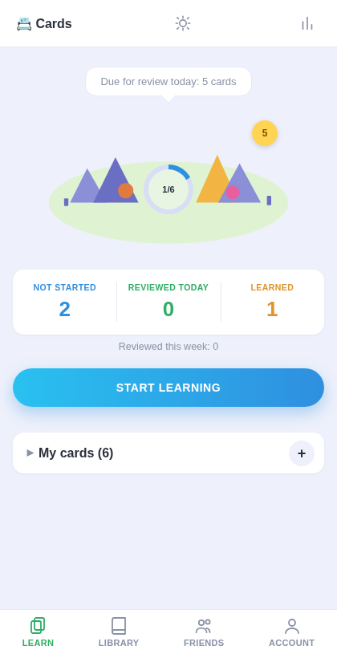
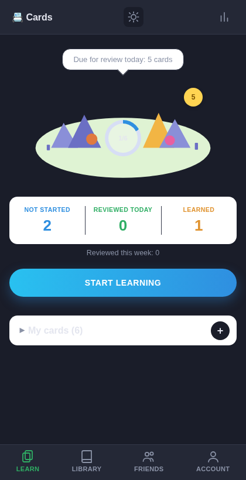
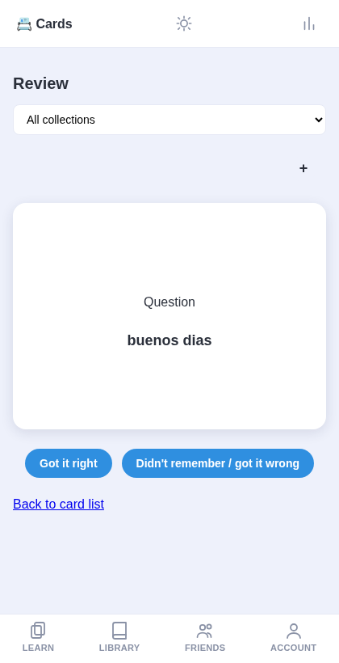
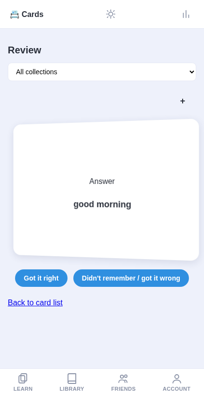
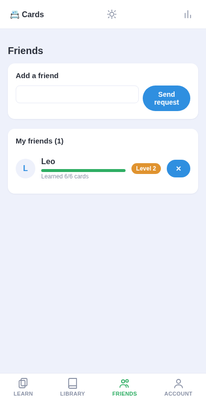
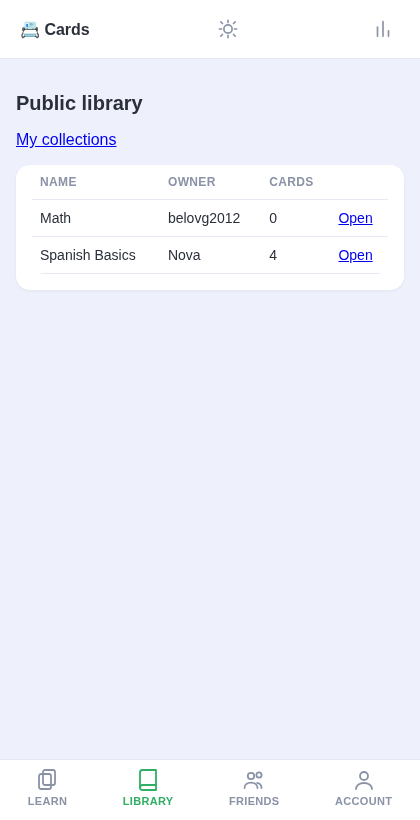

# Cards 📇

A spaced-repetition flashcard app built with Django. Create cards, review them on a schedule that adapts to how well you know each one, organize them into shareable collections, and track progress against friends.

> **Status: work in progress.** The feature set below is functional and tested, but the visual design is still the rough first pass. The plan is to redesign the UI properly, then cut a proper release.

## Features

- **Spaced repetition** — each card moves along a fixed ladder of review intervals (90 seconds → 2 months); a correct answer advances it, a wrong one steps it back.
- **Flip-card review** — click the card (or answer it) to reveal the back, in a real 3D flip.
- **Collections** — group your cards into named collections with three visibility levels: private, unlisted (share by link), or public (listed in the shared library).
- **Shared library** — browse other users' public collections and copy ("take") individual cards into your own, starting fresh at stage 0.
- **Friends & progress** — add friends by nickname or email, see their current level based on how many cards they've mastered.
- **Nickname or email login** — register with a nickname (used for friends/sharing) and sign in with either it or your email.
- **Dark mode** — toggle in the top bar, remembered across visits.
- **Test mode** — a toggle that compresses review intervals to seconds, for trying out the whole scheduling flow without waiting.

## Screenshots

| | |
|---|---|
|  |  |
|  |  |
|  |  |

## Tech stack

Django 6.1, SQLite, server-rendered templates with vanilla CSS/JS (no frontend framework, no build step).

## Getting started

```bash
git clone https://github.com/paladinchik56/memoryCards.git
cd memoryCards
python -m venv .venv
source .venv/bin/activate        # .venv\Scripts\activate on Windows
pip install -r requirements.txt  # or: pip install django
python manage.py migrate
python manage.py runserver
```

Open `http://127.0.0.1:8000/`, register an account (confirmation codes are sent via Django's console email backend by default — check your terminal output for the code), and start adding cards.

Run the test suite with:

```bash
python manage.py test
```

## Roadmap

- [ ] Redesign the UI (current styling is functional, not polished)
- [ ] First tagged release
